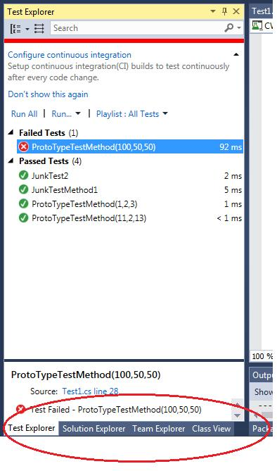

# CWMasterTeacher Testing Guide

## What is a unit test?

MSDN outlines the goal of unit testing: “The primary goal of unit testing is to take the smallest piece of testable software in the application, isolate it from the remainder of the code, and determine whether it behaves exactly as you expect."

TODO add some more here?

## Test driven development

Test driven development is a simple iterative cycle where the tests are written before the code that the tests are testing. It requires an understanding of how the code should work and what needs to be tested.

1. Write a unit test.
  * This test should be written such that running it now fails. A test with no underlying code implementation that passes isn't actually testing anything!
2. Implement enough of the underlying code to get the test to pass when it runs.
3. Repeat until the underlying code has been finished and is sufficiently tested.


## Writing unit tests


### Using NUnit 

The CWMasterTeacher project uses the NUnit framework. This guide will introduce you to the basics of NUnit.
NUnit can be used for testing all .NET languages. You can visit [NUnit Wiki](https://github.com/nunit/docs/wiki) on github for more information on using NUnit.

#### NUnit Attributes

NUnit offers many different kinds of attributes for marking test methods and classes. 

`[TestFixture]` declares a class as a test fixture. This is needed for all test classes.

`[Test]` The basic attribute for a unit test. Any methods inside a `[TestFixture]` marked with this attribute will be considered a unit test by NUnit.

`[TestCase(...)]` The attribute for parameterized tests. Any methods inside a `[TestFixture]` marked with this attribute will be considered a unit test and run with the provided arguments. See below for examples of using this attribute.


`[SetUp]` Methods marked with this attribute will be called before *every* test within a fixture. Useful for setting up commonly used objects among tests.

`[TearDown]` Methods marked with this attribute will be called after *every* test within a fixture.


`[Author("Tester Name")]` An attribute used to denote the test author.
#### Author Tags

It makes more sense to tag an author in the creation of a test fixture and the test methods. Other authors can come in and edit the test fixture by adding a new test method or changing a test method. The `[Author("Joe Doe", "Amanda Doe")] would be ideal for adding multiple authors.

```C#
[TestFixture]
[Author("Richard")]
public class Test1
{
    [TestCase(10, 20, 30)]
    [TestCase(-5, 15, 10)]
    [Author("Joe")]
    public void AddNumbersTest(int a, int b, int expected)
```

Richard was the one who created the test fixture but Joe added the test method later. If both Richard and Joe made the fixture then naturally they would both be in there as well.


More on attributes can be found [here](https://github.com/nunit/docs/wiki/Attributes).


#### NUnit Assertions

Inside of each unit test you will need to make an assertion. This is the statement that must be valid for the test to pass. It is best to limit the number of assertions inside a unit test to 1 or a few.

NUnit provides many different ways to make assertions. Some useful examples using NUnit3 style constraints:

```C#
//Test objects are equal
Assert.That(1, Is.EqualTo(1));
Assert.That(testString, Is.EqualTo(expectedString);

//Test if something is empty.
Assert.That(someString, Is.Empty);

//Conditionals
Assert.That(condition, Is.True);
Assert.That(condition, Is.False);

//Checking for null
Assert.That(returnValue, Is.Null);


//Constraints can be negated using Not
Assert.That(returnValue, Is.Not.Null);
Assert.That(someString, Is.Not.Empty);

//Testing for thrown Exceptions
Assert.That(testMethod(badArgument), Throws.ArgumentException);
```


More on NUnit assertions can be found [here](https://github.com/nunit/docs/wiki/Assertions).
A list of constraints can be found [here](https://github.com/nunit/docs/wiki/Constraints).

### NUnit examples

An example using CWMasterTeacher

```C#
using System;
using NUnit.Framework;
using CWMasterTeacher3;

namespace CWTesting
{
    [TestFixture]
    class WebUtilitiesTest
    {   
        private DateTime testDate;

        [SetUp]
        public void SetUp()
        {   
            testDate = new DateTime(2015, 10, 8, 13, 20, 0); 
        }   

        [Test]
        [Author("Nick Beier")]
        public void DateTime_ToLongDateString_FormatTest()
        {   
            string expectedDateFormat = "Thu, Oct 8";
            string longDateFormat = WebUtilities.DateTime_ToLongDateString(testDate);
            Assert.That(expectedDateFormat, Is.EqualTo(longDateFormat));

        }   

        [Test]
        [Author("Nick Beier")]
        public void DateTime_ToDateString_FormatTest()
        {   
            string expectedDateFormat = "Oct 8, 2015";
            string toDateString = WebUtilities.DateTime_ToDateString(testDate);
            Assert.That(toDateString, Is.EqualTo(expectedDateFormat));
        }   
    }   
}
```


### Using Moq

Moq is a mocking library for use in unit testing. Unit tests should be isolated to the object or class under testing, not any dependencies of the object. Mocks are objects created by the unit test that can stand in as a dependency allowing the unit test to isolate the testing object's behavior.

#### Where to use Moq

Mocks are used to isolate test conditions especially if they are out of your control or if you are testing with a database mocks can be used to 'mock' objects that return data for testing.

Moq will be useful for testing the Repositories and anything that acts directly with the database.

#### Examples using Moq

The following simple example introduces how to use Moq. To start you setup the object that we are mocking which is an interface that will contain the method or methods for both the object and mock object.

A quick example, if you are testing a Car which has an Engine and the Engine isn't implemented yet the Car needs something in order to be tested. The Engine would need to be mocked, mock information about the Engine can be returned
by this mock or even mock the state of the Engine. 

In the example we are just mocking the object that will have the method we wish to get data for testing with.


The Interface containing method(s) to test or mock
``` C#
interface MockObject
{
    List<Animal> getAnimals();
}
```

The example object
``` C#
class Animal
{
    private string Type {get; set;}

    public Animal(string type)
    {
        Type = type;
    }
}
```

The test controller
``` C#
public class MockObjectController
{
    private MockObject Mock;

    public AnimalController (IAnimalRepository mock)
    {
        Mock = mock;
    }

    public List<Animal> getAnimals()
    {
        return Mock.getAnimals();
    }
}
```

The Test
``` C#
[TestFixture]
[Author("Andrew Becker", "Richard DeSilvey")]
public class AnimalTest
{
    [Test]
    public void MockingTest()
    {
        // Arrange - Create a mock that will return mock data or expected test data
        List<Animal> expectedList = new List<Animal>();
        expectedList.Add(new Animal("Bear"));
        expectedList.Add(new Animal("Wolf"));

        Mock<MockObject> mockObject = new Mock<MockObject>();
        mockObject.Setup(x => x.getAnimals()).Returns(expectedList);

        MockObjectController controller = new MockObjectController(mockObject.Object);

        // Act - Use the controller to call the method that is being tested or get 
        // mock data
        List<Animal> actualList = controller.getAnimals();

        // Assert - The mocked list can now be part of a test or test 
        // an object's functionality
        Assert.That(actualList, !Is.Empty);
    }
}
```

TODO get real examples eventually


## Structure of the CWTesting project

All tests for CWMasterTeacher should be contained in files under the CWTesting project.

The CWTesting project has a Tests directory where tests should be stored.

```
CWTesting
 -->Tests
   -->Factories
     -->ClassSectionModelFactoryTest.cs
   -->DbObjects
     -->ClassSectionTest.cs
```

The Tests directory should follow the directory structure of the CWMasterTeacher projects. Tests for Factories should go under the Factories folder, etc. If the folder is missing please create it. For each class that has tests written for it the tests should be contained in a file named after the class and appending the nameTest to it. Eg. the WebUtilities.cs class has its tests located under WebUtilitiesTest.cs.

## Running the tests

In Visual Studio the tests are run using the Test Explorer.

To open the Test Explorer click on the Test>Windows>Test Explorer.

The Test Explorer window has convienient buttons to run all of the tests or an individual test. It is best to run all of the tests whenever changes are made to the code.




## CWMasterTeacher Testing Conventions

### What should and should not be tested

Unit tests should test behavior, not necessarily methods. For example it makes little sense to getter and setter methods. Many tests will require a combination of method calls so having a test for each method not make sense.

In testing behavior we should be trying to expose bugs. Beyond normal expected behavior there are several edge cases we want to ensure we test for:

1. **Nullable types**
  * Any time something can accept a nullable type we should test passing null in and make sure the object handles it gracefully. The exception assertions above are useful here.
2. **Empty strings**
3. **Boundary cases**
  * If it accepts a number what happens if the number is 0
  * Negative numbers
  * Int32.MaxValue
  * Using the `[TestCase(x,y,z)]` attribute can be useful for these types of checks.


### Unit test naming conventions
When a large group is working on a project, it is always a good idea to use universal naming conventions. This does not only apply to the code itself, but to the names of the classes and functions as well.

1. Methods - Each testing method should be named by giving a brief description of what exactly it is testing for using the “MethodName_Description” format. 

2. Classes - The naming convention here is to simply add “Test” to the name of the class which contains the method(s) we are testing. In the previous example, the Add function was part of the MathHelper object, so we named the test class **MathHelperTest**.

Because of this naming convention, we will know exactly what portion of the test either passes or fails without having to expand each individual test case. Without even knowing any code, we would understand exactly what to look at if “EmailHasValidEmailAddress” in the “StudentTest” class failed the unit test.


### Tests should be FIRST guideline

[F] : Fast

When unit tests run they take time to complete. Unit tests should be fast otherwise it becomes a problem everytime you make a change to the code base you have to wait for your test suite to complete.

[I] : Isolate

Unit tests are testing **units** or **chunks** of code. The code you are testing may interact with a database or shared data, these tests shouldn't be testing on the same database as other developers. This may cause tests to fail sometimes and create flaky tests. Elements of tests should be isolated. Anything outside your control should be mocked or stubbed.

[R] : Repeatable

Good tests are repeatable, that is each time tests are run they always produce the same results. Tests that sometimes pass or sometimes fail are bad tests. 

[S] : Self-Validating

Tests are supposed to be able to save time. If your tests are pumping out verbose output then you are wasting time. Your tests should be validating expected data with little to no output to logs. The only time output is needed is if the
test fails with proper description.

[T] : Timely

Unit testing is a good habit to have, you can write tests at virtually anytime but writing tests in a timely fashion is very important for meeting deadlines. If you start to neglect writing tests, similar to skipping any kind of good habit, will cause problems to slowly build. Similar to doing chores around your house. Sometimes you may skip vacuuming that one
time but continue to neglect it and dust really starts to build and when you do go and clean it takes longer to do.

Keep in mind that writing tests also adds more code that must be maintained. Writing good simple, focused, maintainable tests saves time and saves money. 

### Arrange Act Assert guideline

According to Microsoft, a unit test should be split up into three main categories. These are arrange, act, and assert. Most unit tests should be short and easy to read and understand. Comments are usually not needed because the test itself should be descriptive through its code.

1. Arrange – This is where you declare any of the variables that will be needed throughout the testing of each method. Everything but the method we’re testing should be set in this category.

2. Act – This is where the logic happens. All of the pieces that are required to run the method(s) have already been created, so it’s time to run the method in question. This will generally contain 1-2 lines of code.

3. Assert – This is the test itself. We will assert that the result of the method is supposed to either be equal to, or not equal to, the expected result defined by the user. This will generally only contain one or two lines of code.

``` C#
[TestFixture]
public class MathHelperTest
 {
      [TestCase(10, 20, 30)]
      [TestCase(-5, 15, 10)]
      public void AddNumbersTest(int a, int b, int expected)
      {
           //Arrange
           MathHelper helper = new MathHelper();

           //Act
           int result = helper.Add(a, b);

           //Assert
           Assert.That(result, Is.EqualTo(expected));
       }

       // Not ideal for this kind of test, multiple assertions
       [Test]
       public void AddNumbersTest()
       {
                
           MathHelper helper = new MathHelper();

           int result = helper.Add(10, 20);
           Assert.That(result, Is.EqualTo(30));

           result = helper.Add(15, -10);
           Assert.That(result, Is.EqualTo(5));
       }

       // Not ideal, multiple test methods with unnecessary test names would be needed
       [Test]
       public void AddPositiveNumbers()
       {
           MathHelper helper = new MathHelper();

           int result = helper.Add(10, 20);
           Assert.That(result, Is.EqualTo(30));
       }
       [Test]
       public void AddNegativeNumbers()
       {
           MathHelper helper = new MathHelper();

           int result = helper.Add(-10, -20);
           Assert.That(result, Is.EqualTo(-30));
       }
}

```

The above example is ideal to what Dr. Beaty and Dr. Dollard said when it comes to testing arguments. A test method can be written generically and then test cases with data can be easily passed in without having to write up multiple test methods for different kinds of data or writing a very long test method with many types of data and assertions.

## Code Coverage

CWMasterTeacher uses the OpenCover and ReportGenerator packages to track the code coverage of your unit tests.

All code submitted must meet a 90% code coverage minimum to be accepted into the dev branch.

**Currently this is not functional** the coverage reports have yet to be implemented. This will be implemented shortly. Until then just keep the code coverage goal in mind while writing your tests.


## Additional help
For other problems, questions, or guidence please contact any of the three listed below

* Richard - rdesilve@msudenver.edu 
* Andrew - abecke11@msudenver.edu 
* Nick - nbeier@msudenver.edu 
